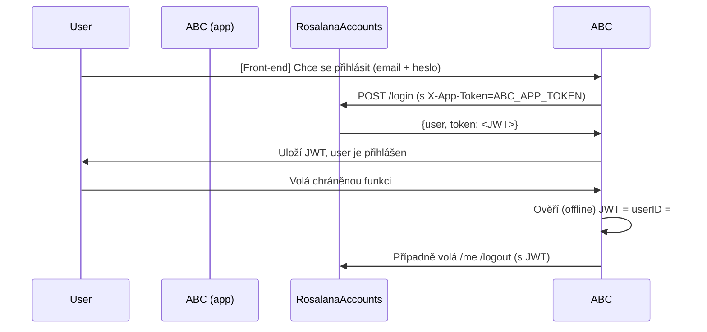

# Rosalana Accounts

Rosalana Accounts je centrální služba pro řízení uživatelských účtů (registrace, login, správa) v ekosystému Rosalana. Všechny aplikace mohou přes API ověřovat uživatele pomocí JWT tokenů. Zároveň je možné registrovat nové „aplikace“ (App tokens), které se tímto API prokazují.

## Přehled funkcí

### Registrace a přihlášení uživatelů

- Registrace (/register) a login (/login) vrací JWT token.
- JWT token mohou ostatní aplikace validovat offline (sdíleným JWT_SECRET či přes RS256).

### Ověření uživatele

- Endpoint /me získá detail přihlášeného uživatele (pokud je JWT validní).
- Endpoint /logout zneplatní token (pokud je blacklist povolen).

### Správa aplikací (Apps)

- Lze registrovat nové aplikace přes /apps/register.
- Každá aplikace má vlastní App Token – slouží k ověření, že daná aplikace smí volat Rosalana Accounts API.
- Endpoints pro výpis aplikací a mazání slouží administrátorům (Master App).

### Zabezpečení

- App token („app.token“ middleware) – ověřuje, že request opravdu pochází z registrované aplikace (nebo z Master).
- JWT Auth („jwt.auth“ middleware) – ověřuje přihlášeného uživatele na základě JWT.
- Master App („app.master“ middleware) – speciální token pro Rosalana Support / Admin, který má práva spravovat aplikace.

## Jak to funguje

1. Aplikace (např. ABC) se zaregistruje v Rosalana Accounts.
2. Získá app_token, který pak posílá v hlavičce X-App-Token (nebo Authorization, dle implementace).
3. Uživatel se registruje přes endpoint /register a následně se přihlašuje pomocí /login.
4. Při přihlášení dostává uživatel JWT token, který front-end (např. localStorage) nebo back-end aplikace ukládá a posílá v hlavičce Authorization: Bearer <JWT>.
5. Rosalana Accounts tímto tokenem umí identifikovat uživatele ve všech dalších voláních (např. /me).
6. Ostatní aplikace (ABC, ABD, …) mohou tentýž JWT token validovat „offline“ (pokud mají stejný JWT_SECRET nebo veřejný klíč v případě RS256).

## High-level flow



## Konvence a nastavení

### X-App-Token:

- Každá aplikace prokazuje svou identitu tímto tokenem.
- Je uložen v DB tabulce apps (sloupec token).

### ROSALANA_MASTER_TOKEN:

- Token pro tzv. „Master App“ – typicky je to Rosalana Support / Admin centrum.
- V .env Rosalana Accounts se nastavuje konstantou ROSALANA_MASTER_TOKEN=....

### JWT:

- Aplikace generuje a ověřuje tokeny přes tymon/jwt-auth.
- Nastavení v .env:

```makefile
JWT_SECRET=someRandomString
JWT_TTL=60
# plus další podle potřeby
```

- Sdílené mezi Rosalana Accounts a ostatními aplikacemi (pokud je HS256).

## API Endpoints:

| Endpoint          | Metoda | Middleware         | Popis                                              |
|-------------------|--------|--------------------|----------------------------------------------------|
| POST /register    | POST   | app.token          | Registrace nového uživatele, vrací JWT             |
| POST /login       | POST   | app.token          | Přihlášení uživatele, vrací JWT                    |
| GET /me           | GET    | app.token, jwt.auth| Získá data o aktuálním uživateli (podle JWT)       |
| POST /logout      | POST   | app.token, jwt.auth| Zneplatní JWT (pokud blacklist je ON)              |
| POST /apps/register | POST | app.master         | Vytvoří novou App (vrací App Token)                |
| GET /apps         | GET    | app.master         | Seznam aplikací                                    |
| GET /apps/{token} | GET    | app.master         | Detaily jedné App                                  |
| DELETE /apps/{token} | DELETE | app.master      | Smazání App                                        |

## Nasazení:

Běžná Laravel aplikace, stačí nastavit .env s parametry:

```makefile
APP_NAME="Rosalana Accounts"
APP_ENV=production
APP_KEY=base64:...
DB_CONNECTION=mysql
DB_HOST=...
DB_DATABASE=rosalana_accounts
DB_USERNAME=...
DB_PASSWORD=...

# JWT
JWT_SECRET=...
JWT_TTL=60

# Master token pro správu aplikací
ROSALANA_MASTER_TOKEN=...

# atd.
```

- Spustit migrace: `php artisan migrate`.
- (Volitelně) Publikovat config: `php artisan vendor:publish --provider="Tymon\JWTAuth\Providers\LaravelServiceProvider"`.
- Hotovo.

## Jak používat

### Registrovat aplikaci (Master App only)

```bash
curl -X POST https://accounts.example.com/apps/register \
     -H "X-App-Token: <MASTER TOKEN>" \
     -d "name=TestApp"
# => { "id": 5, "name": "TestApp", "token": "..." }
```

Nyní token=„abc123…“ přiřaďte aplikaci TestApp.

### Login uživatele

```bash
curl -X POST https://accounts.example.com/login \
     -H "X-App-Token: <token of the calling app>" \
     -H "Content-Type: application/json" \
     -d '{"email": "john@example.com", "password": "secret"}'
# => { "user": { ... }, "token": "<JWT>" }
```

### Volání chráněných endpointů

```bash
curl -X GET https://accounts.example.com/me \
     -H "X-App-Token: <app_token>" \
     -H "Authorization: Bearer <JWT>"
# => { "user": { ... } }
```

## Ready to Deploy

Tuto aplikaci můžete nasadit na:

- VPS (Linux + PHP-FPM + Nginx/Apache)
- Docker s oficiálním php:8.x-fpm + nginx:alpine (potřeba volume pro .env)
- Laravel Forge, Ploi, nebo jiné hostingy

Nezapomeňte:

- Vytvořit databázi a spustit `php artisan migrate`.
- Nastavit .env (hlavně APP_KEY, JWT_SECRET a ROSALANA_MASTER_TOKEN).
- Zabezpečit veřejné URL (HTTPS, nastavit APP_ENV=production, APP_DEBUG=false).

## Další vývoj

- Refresh tokeny: Pro dlouhodobé session by se mohla přidat funkce /refresh.
- Přechod na RS256: Pro oddělení možností „podepisovat tokeny“ a „pouze validovat“.
- Notifikace: Napojení na Rosalana Notification Service.
- Subscriptions: Napojení na Rosalana Subscription modul.

## Licence & Kontakt

(Doplňte dle vlastního uvážení, např. MIT, or private.)

Author: Vaše jméno, vaše webstránka